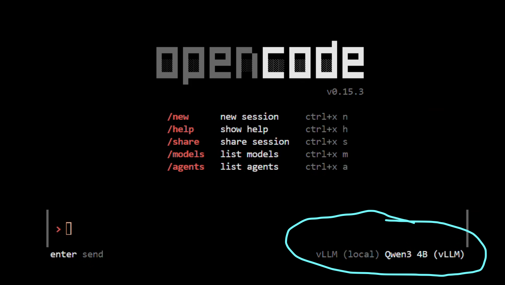
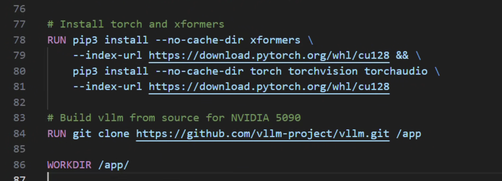
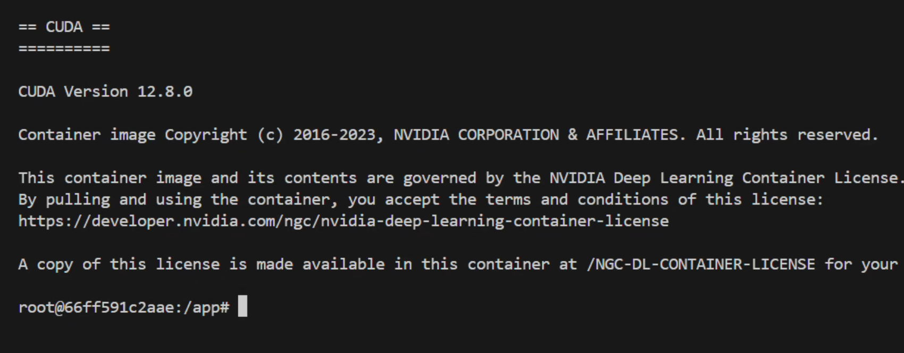

<div align="center">
  
  <br>
</div>

# vLLM + OpenCode + LMCache: Docker Environment for NVIDIA RTX 5090

**AI-Powered Development Environment with Local vLLM Inference**

**👨‍💻 Author**: Shlomo Kashani
**🏫 Affiliation**: Johns Hopkins University, Maryland U.S.A.
**🏢 Organization**: QNeura.ai

[](https://docker.com)
[](https://docs.microsoft.com/en-us/windows/wsl/)
[](https://nvidia.com)
[](https://linux.org)
[](https://python.org)
[](https://nodejs.org)

This project provides a complete Docker-based development environment combining vLLM (high-performance LLM inference), LMCache (KV cache optimization), and OpenCode (AI coding assistant) - all optimized for NVIDIA RTX 5090 on WSL2/Windows and Linux.

<div align="center">
  
  <br>
</div>

## 🪄 The Magic: OpenCode + Local vLLM

The unique feature of this setup is **OpenCode running inside the same Docker container as vLLM**. This enables:

- ✅ **Zero-latency AI coding** - OpenCode connects to vLLM via localhost
- ✅ **Complete privacy** - All inference happens locally, no cloud API calls
- ✅ **Cost-free AI assistance** - Use your own models (Qwen, Gemma, DeepSeek, etc.)
- ✅ **Full control** - Switch models, tune parameters, monitor GPU usage
- ✅ **RTX 5090 Optimized** - Tuned for 32GB GDDR7 and Ada Lovelace architecture

```
┌─────────────────────────────────────────────────────┐
│                Docker Container                      │
│                                                      │
│  ┌──────────────┐          ┌──────────────┐        │
│  │   OpenCode   │  ←───→   │     vLLM     │        │
│  │              │localhost │   Server     │        │
│  │ (AI Coding)  │  :8000   │  (Inference) │        │
│  └──────────────┘          └──────────────┘        │
│                                    ↓                 │
│                            NVIDIA RTX 5090          │
│                              32GB GDDR7             │
└─────────────────────────────────────────────────────┘
```

<div align="center">
  
  <br>
</div>

# Fast Track 

```bash
# Windows
.\build.bat
# Linux/Mac
docker build -t lmcache-vllm:latest --target image-build -f docker/Dockerfile .
```
# Windows
.\run-d.bat
```bash
bash /workspace/oc-vllm.sh
```
**Start coding with AI:**
```bash
opencode -m vllm/Qwen/Qwen3-4B
```


## 🚀 What This Solves

Running large language models on cutting-edge GPUs like the RTX 5090 in WSL2 can be challenging due to dependency management and environment conflicts. This project provides a ready-to-use Docker container that:

- **Eliminates setup headaches** - Pre-configured with all dependencies
- **Enables local AI coding** - OpenCode integrated with vLLM for private, fast AI assistance
- **Optimizes for RTX 5090** - Tuned settings for 32GB GDDR7 memory
- **Works on WSL2/Linux** - Seamless support for both platforms
- **Includes training tools** - Complete data science stack with unified scripts

## 📦 What's Included

### Core Components
- **CUDA 12.8** runtime optimized for RTX 5090
- **Python 3.12** with system-wide packages (no venv restrictions)
- **vLLM** (nightly) with runai, tensorizer, and flashinfer support
- **LMCache** for KV cache optimization
- **Node.js v18.19.1** and **npm 9.2.0**

### AI Coding Tools
- **opencode-ai** - AI coding assistant (pre-installed)
- **@anthropic-ai/claude-code** - Claude Code CLI (pre-installed)
- **TypeScript** and **ts-node** (pre-installed)

### Data Science Stack
- **Training**: peft, trl, accelerate, bitsandbytes
- **Core ML**: pandas, numpy, scipy, scikit-learn
- **Deep Learning**: torch, transformers, xformers
- **Utilities**: jupyter, jupyterlab, gradio, matplotlib, seaborn


<div align="center">
  
  <br>
</div>

## 📋 System Requirements

### Hardware Requirements
- **GPU**: NVIDIA RTX 5090 with 32GB GDDR7 VRAM (or compatible GPU)
- **RAM**: Minimum 32GB system RAM (64GB recommended)
- **Storage**: 100GB+ free space for models and Docker images

### Software Requirements

#### Windows with WSL2
- Windows 11 (Build 22000 or later)
- WSL2 with Ubuntu 20.04+ or compatible distribution
- NVIDIA GPU drivers with WSL2 support (550+ series)
- Docker Desktop with WSL2 backend

#### Linux (Ubuntu/Debian)
- Ubuntu 20.04+ or compatible distribution
- NVIDIA GPU drivers (550+ series recommended)
- Docker CE/EE

### Dependencies (Pre-installed in Docker)
- Docker 24.0+
- NVIDIA Container Toolkit (nvidia-docker2)
- Python 3.12
- CUDA 12.8
- PyTorch 2.7.0 (installed during build)
- Node.js 18.19.1 & npm 9.2.0

## 🚀 Quick Start

### 1. Build the Docker Image

```bash
# Windows
.\build.bat

# Linux/Mac
docker build -t lmcache-vllm:latest --target image-build -f docker/Dockerfile .

```

**Build time**: ~15-20 minutes
**Final image size**: ~33.9 GB
**Image name**: `lmcache/vllm-openai:build-latest`

### 2. Start the Container

```bash
# Windows
.\run-d.bat

# Linux/Mac
docker run --gpus all --rm -it \
  --shm-size=8gb --ipc=host \
  --ulimit memlock=-1 --ulimit stack=67108864 \
  --memory=16g --env=DISPLAY \
  -p 8000:8000 -p 8078:7842 -p 7861:7860 -p 8502:8501 \
  -v $(pwd):/root/sharedfolder \
  -v ~/cache:/root/.cache \
  lmcache/vllm-openai:build-latest
```

**Port mappings:**
- `8000:8000` - vLLM OpenAI API
- `7861:7860` - Gradio apps
- `8078:7842` - Additional services
- `8502:8501` - Streamlit apps

### 3. Start vLLM Server

Inside the container, use the pre-configured script:

```bash
bash /workspace/oc-vllm.sh
```

Or start manually with custom settings:
```bash
vllm serve Qwen/Qwen3-4B \
  --port 8000 \
  --tensor-parallel-size 1 \
  --gpu-memory-utilization 0.8 \
  --max-model-len 20000 \
  --enable-auto-tool-choice \
  --tool-call-parser hermes \
  --trust-remote-code
```

**Verify it's running:**
```bash
curl http://localhost:8000/v1/models
```

### 4. Use OpenCode with Your Local vLLM

**Start coding with AI:**
```bash
opencode  --model vllm/qwen3-4b
```


That's it! OpenCode now uses your local vLLM for AI assistance. **No cloud, no costs, complete privacy!**

## 📁 Configuration Files

### opencode.json - Pre-configured for vLLM

**Locations in Docker:**
- `/workspace/opencode.json`
- `/root/.config/opencode/opencode.json`

**Pre-configured Models:**
```json
{
  "$schema": "https://opencode.ai/config.json",
  "provider": {
    "vllm": {
      "npm": "@ai-sdk/openai-compatible",
      "name": "vLLM (local)",
      "options": {
        "baseURL": "http://localhost:8000/v1"
      },
      "models": {
        "qwen3-4b": {
          "name": "Qwen3 4B (vLLM)",
          "contextWindow": 32768,
          "maxTokens": 4096
        },
        "qwen-0.5b": { "name": "Qwen 0.5B", "contextWindow": 32768, "maxTokens": 2048 },
        "qwen-14b": { "name": "Qwen 14B", "contextWindow": 32768, "maxTokens": 4096 },
        "gemma-4b": { "name": "Gemma 4B", "contextWindow": 8192, "maxTokens": 2048 },
        "gemma-9b": { "name": "Gemma 9B", "contextWindow": 8192, "maxTokens": 2048 },
        "deepseek-7b": { "name": "DeepSeek 7B", "contextWindow": 16384, "maxTokens": 4096 }
      }
    }
  }
}
```

The configuration points OpenCode to `http://localhost:8000/v1` - your local vLLM server!

### oc-vllm.sh - Quick vLLM Launcher

**Location:** `/workspace/oc-vllm.sh`

**Contents:**
```bash
vllm serve Qwen/Qwen3-4B \
  --tensor-parallel-size 1 \
  --gpu-memory-utilization 0.8 \
  --max-model-len 20000 \
  --enable-auto-tool-choice \
  --tool-call-parser hermes \
  --trust-remote-code
```

**Usage:**
```bash
bash /workspace/oc-vllm.sh
```

## 🛠️ Advanced Usage

### Training Models

Use the unified training script:

```bash
cd /workspace

# LoRA fine-tuning (Qwen/Gemma/DeepSeek)
python scripts/train.py \
  --model_path /root/sharedfolder/mdls/qwen3-4b \
  --output_path /root/sharedfolder/output \
  --epochs 1

# DeBERTa training (auto-detected)
python scripts/train.py \
  --model_path microsoft/deberta-v3-base \
  --output_path /root/sharedfolder/output
```

### Running Inference

Use the unified inference script:

```bash
cd /workspace

# Single GPU inference
python scripts/infer.py \
  --model_path /root/sharedfolder/mdls/qwen3-4b \
  --lora_path /root/sharedfolder/output \
  --output_file submission.csv

# Multi-GPU inference (auto-configured)
python scripts/infer.py \
  --model_path /root/sharedfolder/mdls/qwen-14b \
  --output_file submission.csv
```

### Using Jupyter Lab

```bash
jupyter lab --ip=0.0.0.0 --port=8888 --allow-root --no-browser
```

Access at: `http://localhost:8888`

### Running Gradio Apps

```bash
python app-vllm-gradio.py
```

Access at: `http://localhost:7861/` (mapped from container's 7860)

### Installing Additional Packages

**Python packages:**
```bash
pip install <package>
# or
uv pip install --system <package>
```

**npm packages:**
```bash
npm install -g <package>
```

No restrictions - install freely!

## 📂 Project Structure

```
d-git-vllm/
├── README.md                    # This file
├── build.bat                    # Build Docker image (Windows)
├── run-d.bat                    # Run container with bash (Windows)
├── run_qwen4b.bat              # Run container with Qwen-4B
├── oc-vllm.sh                  # Quick vLLM launcher script
├── opencode.json               # OpenCode configuration for vLLM
│
├── assets/                     # Logo and screenshots
│   ├── light-mode-logo.svg
│   ├── 01.png, 02.png, 03.png
│
├── docker/
│   ├── Dockerfile              # Main Dockerfile
│   ├── BUILD.md               # Docker build guide
│   └── CONTAINER_USAGE.md     # Container usage reference
│
├── requirements/
│   ├── common.txt             # Common Python dependencies
│   ├── cuda.txt               # CUDA dependencies (torch, etc.)
│   ├── ds-stack.txt           # Data science stack
│   └── build.txt              # Build-time dependencies
│
├── scripts/
│   ├── train.py               # Unified training script
│   ├── infer.py               # Unified inference script
│   ├── README.md              # Scripts documentation
│   ├── constants.py           # Constants and configuration
│   ├── utils.py               # Utility functions
│   └── legacy/                # Archived model-specific scripts
│
├── app-*.py                   # Gradio/Streamlit apps
│
├── lmcache/                   # LMCache Python source
├── csrc/                      # CUDA C++ extensions
├── setup.py                   # LMCache setup
└── pyproject.toml             # Python project metadata

Documentation:
├── OPENCODE_SETUP.md          # Detailed OpenCode setup guide
├── NPM_AI_TOOLS.md            # AI tools reference
└── DOCKER_CHANGES.md          # Summary of Docker changes
```

## 🔧 File Locations (Inside Container)

### Important Paths

| Path | Description |
|------|-------------|
| `/workspace/` | Main working directory |
| `/workspace/opencode.json` | OpenCode configuration |
| `/workspace/oc-vllm.sh` | vLLM launcher script |
| `/workspace/scripts/` | Unified training/inference scripts |
| `/workspace/app-*.py` | Gradio/Streamlit apps |
| `/root/.config/opencode/` | OpenCode config directory |
| `/root/sharedfolder/` | Mounted host directory (`%USERPROFILE%/dev/`) |
| `/root/.cache/` | Hugging Face cache |

### Configuration Locations

- **OpenCode config:** `/root/.config/opencode/opencode.json`
- **OpenCode workspace copy:** `/workspace/opencode.json`
- **vLLM launcher:** `/workspace/oc-vllm.sh`

### Mounted Volumes

- **Host models:** `%USERPROFILE%/dev/mdls/` → `/root/sharedfolder/mdls/`
- **Host data:** `%USERPROFILE%/dev/` → `/root/sharedfolder/`
- **HF cache:** `%USERPROFILE%/dev/mdls/.cache` → `/root/.cache/`

## 🎯 Supported Models

Pre-configured in `opencode.json`:

| Model | Context | Max Tokens | Best For | Memory (Est.) |
|-------|---------|------------|----------|---------------|
| Qwen3 4B | 32k | 4k | General coding, balanced performance | ~8 GB |
| Qwen 0.5B | 32k | 2k | Fast responses, simple tasks | ~2 GB |
| Qwen 14B | 32k | 4k | Complex reasoning, multi-GPU | ~28 GB |
| Gemma 4B | 8k | 2k | Efficient coding, small footprint | ~8 GB |
| Gemma 9B | 8k | 2k | Advanced tasks, Google ecosystem | ~18 GB |
| DeepSeek 7B | 16k | 4k | Code-focused, debugging | ~14 GB |

## 🔥 RTX 5090 Optimizations

This setup is optimized for **NVIDIA RTX 5090** (32GB GDDR7):

### CUDA Settings
- **CUDA Version:** 12.8 (latest)
- **Flash Attention:** Enabled with latest optimizations
- **Tensor Cores:** Automatically utilized
- **Architecture List:** `10.0+PTX 12.0+PTX` (includes Ada Lovelace+)
- **CUDA Arch (Flash Attn):** `120`

### vLLM Optimizations
```bash
--gpu-memory-utilization 0.8    # Use 80% of 32GB (25.6GB)
--tensor-parallel-size 1        # Single GPU (can use 2-4 for larger models)
--max-model-len 20000          # Optimize for RTX 5090 memory
--enforce-eager                 # Predictable memory usage
```

### Memory Usage Guide

| Model Size | Tensor Parallel | GPU Memory | Recommended |
|------------|----------------|------------|-------------|
| 0.5B - 7B | 1 | ~2-14 GB | ✅ Single RTX 5090 |
| 7B - 13B | 1 | ~14-26 GB | ✅ Single RTX 5090 |
| 14B - 30B | 2 | ~28-60 GB | 🔄 Needs 2x RTX 5090 |
| 30B+ | 4 | 60GB+ | 🔄 Needs 4x RTX 5090 |

### Performance Tuning Variables

| Variable | Default | Description |
|----------|---------|-------------|
| `MAX_JOBS` | `2` | Number of parallel build jobs |
| `NVCC_THREADS` | `8` | CUDA compilation threads |
| `TORCH_CUDA_ARCH_LIST` | `'10.0+PTX 12.0+PTX'` | Target CUDA architectures |
| `FLASH_ATTN_CUDA_ARCHS` | `120` | FlashAttention architectures |
| `GPU_MEMORY_UTILIZATION` | `0.8` | GPU memory usage ratio |

## 🎮 Example Workflows

### Workflow 1: AI-Assisted Coding

```bash
# 1. Start container
.\run-d.bat

# 2. Inside container, start vLLM
bash /workspace/oc-vllm.sh

# 3. Open new terminal, exec into same container
docker exec -it <container-id> bash

# 4. Authenticate OpenCode (first time only)
opencode auth login

# 5. Start coding with AI
opencode --provider vllm --model qwen3-4b

# Now you have AI-powered coding with your local model!
```

### Workflow 2: Train and Deploy Model

```bash
# 1. Train a LoRA adapter
cd /workspace
python scripts/train.py \
  --model_path /root/sharedfolder/mdls/qwen3-4b \
  --output_path /root/sharedfolder/lora-output

# 2. Run inference with trained LoRA
python scripts/infer.py \
  --model_path /root/sharedfolder/mdls/qwen3-4b \
  --lora_path /root/sharedfolder/lora-output \
  --output_file results.csv

# 3. Deploy with vLLM
vllm serve /root/sharedfolder/mdls/qwen3-4b \
  --port 8000 \
  --enable-lora \
  --lora-modules lora-1=/root/sharedfolder/lora-output
```

### Workflow 3: Multi-Model Development

```bash
# Terminal 1: Run Qwen3-4B for coding
vllm serve Qwen/Qwen3-4B --port 8000

# Terminal 2: Use OpenCode
opencode --provider vllm --model qwen3-4b

# Terminal 3: Run Gemma-9B on different port
vllm serve google/gemma-2-9b --port 8001

# Terminal 4: Test both models
curl http://localhost:8000/v1/chat/completions -d '{...}'
curl http://localhost:8001/v1/chat/completions -d '{...}'
```

## 📊 Performance Benchmarks

### RTX 5090 Performance (Estimated)

| Model | Memory Usage | Tokens/s | Max Context | Batch Size |
|-------|--------------|----------|-------------|------------|
| Qwen3 4B | ~8 GB | 80-120 | 32K | 1-4 |
| Gemma 9B | ~18 GB | 50-80 | 8K | 1-2 |
| Qwen 14B | ~28 GB | 40-60 | 32K | 1 |
| DeepSeek 7B | ~14 GB | 60-90 | 16K | 1-2 |

*Benchmarks are estimates for RTX 5090. Actual performance may vary based on specific use case, context length, and batch size.*

## 🐛 Troubleshooting

### OpenCode Can't Connect to vLLM

**Problem:** `Connection refused` or `ECONNREFUSED`

**Solution:**
```bash
# 1. Verify vLLM is running
curl http://localhost:8000/v1/models

# 2. Check if port 8000 is listening
netstat -tlnp | grep 8000

# 3. Check opencode.json has correct URL
cat ~/.config/opencode/opencode.json
# Should show: "baseURL": "http://localhost:8000/v1"
```

### GPU Not Detected

**Problem:** `CUDA not available` or `No GPU found`

**Solution:**
```bash
# Check GPU is visible
nvidia-smi

# Verify Docker has GPU access
docker run --gpus all nvidia/cuda:12.8-base nvidia-smi

# For WSL2: Update WSL2 kernel
wsl --update --web-download

# Restart container with --gpus all flag
.\run-d.bat
```

### CUDA Out of Memory

**Problem:** `CUDA out of memory` during inference

**Solution:**
```bash
# Reduce GPU memory utilization
vllm serve <model> --gpu-memory-utilization 0.6

# Reduce max model length
vllm serve <model> --max-model-len 10000

# Use smaller batch sizes
vllm serve <model> --max-num-seqs 1

# Enable memory defragmentation
export PYTORCH_CUDA_ALLOC_CONF=max_split_size_mb:512

# Use smaller model
vllm serve Qwen/Qwen3-0.5B  # Instead of 4B
```

### Port Conflicts

**Problem:** Port already in use

**Solution:**
```bash
# Change default ports
-p 8001:8000  # API server
-p 7862:7860  # Gradio UI

# Or kill process using the port (Windows)
netstat -ano | findstr :8000
taskkill /PID <process-id> /F
```

### Model Download Issues

**Problem:** Can't download models from HuggingFace

**Solution:**
```bash
# Set HuggingFace cache
export HF_HOME=/root/.cache/huggingface

# Login to HuggingFace (if needed)
huggingface-cli login

# Use mirror (for regions with slow access)
export HF_ENDPOINT=https://hf-mirror.com
```

### npm/pip Package Conflicts

**Problem:** Can't install packages

**Solution:**
```bash
# This Docker has NO restrictions - you can install freely
pip install <any-package>
npm install -g <any-package>

# No virtual env needed!
# All packages install system-wide
```

## 📚 Additional Documentation

- **[OPENCODE_SETUP.md](OPENCODE_SETUP.md)** - Complete OpenCode setup guide
- **[NPM_AI_TOOLS.md](NPM_AI_TOOLS.md)** - AI coding tools reference
- **[DOCKER_CHANGES.md](DOCKER_CHANGES.md)** - Summary of Docker modifications
- **[docker/BUILD.md](docker/BUILD.md)** - Docker build documentation
- **[docker/CONTAINER_USAGE.md](docker/CONTAINER_USAGE.md)** - Container usage guide
- **[scripts/README.md](scripts/README.md)** - Training & inference scripts guide

## 🤝 Contributing

We welcome contributions! Please follow these guidelines:

1. **Fork** the repository
2. **Create** a feature branch
3. **Test** thoroughly on both WSL2 and Linux
4. **Submit** a pull request with detailed description

### Development Setup

```bash
# Install development dependencies
pip install -r requirements/build.txt

# Run tests
python -m pytest tests/
```

Feel free to:
- Add more models to `opencode.json`
- Create custom training scripts in `scripts/`
- Build Gradio/Streamlit apps as `app-*.py`
- Share your optimizations for RTX 5090

## 📄 License

This project combines multiple open-source components:
- vLLM: Apache 2.0 License
- LMCache: Apache 2.0
- PyTorch: BSD-style License
- NVIDIA Components: NVIDIA Software License
- OpenCode: Check npm package license
- Individual models: Check model cards (Qwen, Gemma, DeepSeek)

## 🙏 Credits

- **vLLM Team** - High-performance LLM inference ([GitHub](https://github.com/vllm-project/vllm))
- **LMCache Team** - KV cache optimization
- **OpenCode** - AI coding assistant
- **Anthropic** - Claude Code CLI
- **Model Authors**:
  - Qwen (Alibaba Cloud)
  - Gemma (Google DeepMind)
  - DeepSeek (DeepSeek AI)

## 🚀 Why This Setup?

### Traditional AI Coding:
```
Your Code → Cloud API → $$$$ → Response
            (Slow, Expensive, Privacy Concerns)
```

### This Setup:
```
Your Code → OpenCode → localhost:8000 → vLLM → RTX 5090 → Response
            (Fast, Free, Private, Unlimited)
```

You get **enterprise-grade AI coding** on your **local machine** with **zero ongoing costs** and **complete privacy**. All powered by your RTX 5090!

### Key Advantages:

1. **💰 Zero Cost**: No API fees, no subscriptions - unlimited use
2. **🔒 Complete Privacy**: Your code never leaves your machine
3. **⚡ Zero Latency**: Localhost connection = instant responses
4. **🎛️ Full Control**: Switch models, tune parameters, customize everything
5. **🚀 High Performance**: RTX 5090's 32GB GDDR7 enables large context windows
6. **🛠️ Dev-Friendly**: Jupyter, training scripts, Gradio apps all included

## 📝 Citation

If you use this project or vLLM in your research, please cite:

```bibtex
@inproceedings{kwon2023efficient,
  title={Efficient Memory Management for Large Language Model Serving with PagedAttention},
  author={Woosuk Kwon and Zhuohan Li and Siyuan Zhuang and Ying Sheng and Lianmin Zheng and Cody Hao Yu and Joseph E. Gonzalez and Hao Zhang and Ion Stoica},
  booktitle={Proceedings of the ACM SIGOPS 29th Symposium on Operating Systems Principles},
  year={2023}
}
```

## 🔄 Changelog

### v2.0 (2025-10-15): OpenCode Integration + LMCache
- ✨ **NEW**: OpenCode AI coding assistant integrated
- ✨ **NEW**: LMCache for KV cache optimization
- ✨ **NEW**: Unified training and inference scripts
- ✨ **NEW**: Complete data science stack (jupyter, gradio, peft, trl)
- ✨ **NEW**: Pre-configured for 6 models
- 🔧 Removed pip restrictions (free package installation)
- 🔧 Node.js 18.19 + npm 9.2 added
- 🔧 TypeScript and development tools included

### v1.0 (2025-10-02): Initial Release
- 🚀 Docker container for RTX 5090 WSL2 deployment
- 🚀 vLLM optimized for 5090 architecture
- 🚀 Seamless WSL2 integration
- 🚀 CUDA 12.8, PyTorch 2.7.0
- 🚀 Video captioning demo applications

---

<div align="center">

**Built with ❤️ for high-performance AI inference on cutting-edge hardware.**

**Happy Coding with Local AI! 🎉**

For questions or issues, check the documentation files or open an issue.

</div>
