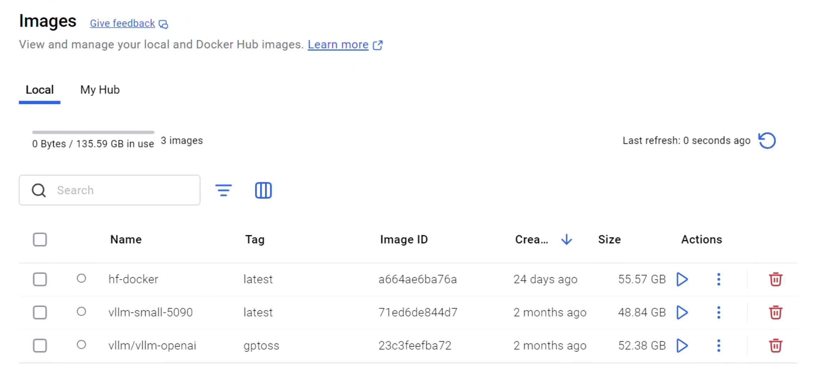

<div align="center">
  
  <br>
</div>


# vLLM-5090: Docker Container for RTX 5090 on WSL2/Windows

**👨‍💻 Author**: Shlomo Kashani
**🏫 Affiliation**: Johns Hopkins University, Maryland U.S.A.
**🏢 Organization**: QNeura.ai

[](https://docker.com)
[](https://docs.microsoft.com/en-us/windows/wsl/)
[](https://nvidia.com)
[](https://linux.org)

A pre-configured Docker environment specifically built for running vLLM on NVIDIA RTX 5090 GPUs within Windows WSL2. Includes demonstration applications showing vLLM's capabilities with vision-language models for video analysis and image processing.

<div align="center">
  
  <br>
</div>

## 🚀 What This Solves

Running large language models on cutting-edge GPUs like the RTX 5090 in WSL2 can be challenging due to dependency management and environment conflicts. This project provides a ready-to-use Docker container that eliminates setup headaches, allowing WSL2 users to run vLLM immediately on their 5090 GPUs.

## 🎯 Key Features

- **RTX 5090 Ready**: Containerized environment tuned for 32GB GDDR7 memory and Ada Lovelace architecture
- **WSL2 First**: Optimized Docker configuration for Windows Subsystem for Linux 2
- **Zero Setup**: Pre-built with all dependencies, CUDA 12.8, and PyTorch 2.7.0
- **Multi-Platform**: Works on both Windows WSL2 and native Linux systems
- **Vision-Language Demo**: Includes video captioning and image analysis examples to verify functionality
- **OpenAI Compatible**: Provides compatible API server for easy integration
- **High Performance**: Memory and thread optimizations for maximum throughput

<div align="center">
  
  <br>
</div>

## 📋 System Requirements

### Hardware Requirements
- **GPU**: NVIDIA RTX 5090 with 32GB GDDR7 VRAM
- **RAM**: Minimum 32GB system RAM (64GB recommended)
- **Storage**: 100GB+ free space for models and Docker images

### Software Requirements

#### Windows with WSL2
- Windows 11 (Build 22000 or later)
- WSL2 with Ubuntu 20.04+ or compatible distribution
- NVIDIA GPU drivers with WSL2 support
- Docker Desktop with WSL2 backend

#### Linux (Ubuntu/Debian)
- Ubuntu 20.04+ or compatible distribution
- NVIDIA GPU drivers (550+ series recommended)
- Docker CE/EE

### Dependencies
- Docker 24.0+
- NVIDIA Container Toolkit (nvidia-docker2)
- Python 3.11
- CUDA 12.8
- PyTorch 2.7.0

<div align="center">
  
  <br>
</div>

## 🛠️ Quick Start

### Option 1: Docker Build (Recommended)

1. **Clone and navigate to project directory:**
   ```bash
   git clone <repository-url>
   cd vllm-5090
   ```

2. **Build the optimized Docker image:**
   ```bash
   # Windows
   build.bat

   # Linux/Mac
   docker build -t vllm-small-5090 .
   ```

3. **Run the container:**
   ```bash
   # Windows (run-d.bat)
   run-d.bat

   # Linux/Mac
   docker run --gpus all --rm -it \
     --shm-size=8gb --ipc=host --ulimit memlock=-1 --ulimit stack=67108864 \
     --memory=16g --env=DISPLAY \
     -p 8000:8000 -p 8078:7842 -p 7861:7860 -p 8502:8501 \
     -v $(pwd):/root/app \
     -v ~/cache:/root/.cache \
     vllm-small-5090:latest
   ```

### Option 2: Manual Installation

1. **Install vLLM from source (in container or host):**
   ```bash
   # Install build dependencies
   pip install -r __vllm/requirements/build.txt
   pip install setuptools_scm

   # Build vLLM with CUDA support
   cd __vllm
   python use_existing_torch.py
   pip install --no-build-isolation -v -e .
   ```

2. **Install additional dependencies:**
   ```bash
   pip install qwen-vl-utils accelerate gradio gradio_toggle \
       openai beautifulsoup4 ftfy bitsandbytes datasets optimum \
       auto-gptq soundfile librosa webrtcvad
   pip install -U transformers spaces modelscope
   ```

## 🎯 Usage

### Demo Applications

This project includes two demo applications for person detection:

1. **Direct vLLM Integration** (`app-vllm-gradio.py`): Loads vLLM directly in Python with a Gradio interface. This approach gives you full control over the model and is ideal for custom deployments.

2. **OpenAI-Compatible Server** (`app-openapi-vllm.py`): Uses the OpenAI-compatible API server. This approach is better for production deployments and allows easy integration with existing OpenAI-based applications.

### Starting the VLLM Server

#### Gemma-3 Model (Recommended for RTX 5090)
```bash
python3 -m vllm.entrypoints.openai.api_server \
    --model google/gemma-3-12b-it \
    --port 8000 \
    --max_model_len 18000 \
    --tensor-parallel-size 1 \
    --gpu_memory_utilization 0.95 \
    --max_num_seqs 1 \
    --enforce-eager
```

#### Qwen2.5-VL Model
```bash
python3 -m vllm.entrypoints.openai.api_server \
    --model Qwen/Qwen2.5-VL-7B-Instruct \
    --port 8000 \
    --max_model_len 24000 \
    --tensor-parallel-size 1 \
    --gpu_memory_utilization 0.95 \
    --max_num_seqs 16 \
    --enforce-eager
```

#### JoyCaption Model
```bash
python3 -m vllm.entrypoints.openai.api_server \
    --model fancyfeast/llama-joycaption-beta-one-hf-llava \
    --port 8000 \
    --max_model_len 24000 \
    --tensor-parallel-size 1 \
    --gpu_memory_utilization 0.95 \
    --max_num_seqs 16 \
    --enforce-eager
```

### Video Captioning Web UI

1. **Start the server** as described above
2. **Launch the Gradio interface:**
   ```bash
   python app-opernai-vid-cap-vllm.py
   ```

3. **Access the web interface** at `http://localhost:7860`

### API Usage Example

```python
import requests
import base64
from PIL import Image

# Server configuration
VLLM_SERVER = "http://localhost:8000"

def encode_image(image_path):
    with open(image_path, "rb") as image_file:
        return base64.b64encode(image_file.read()).decode('utf-8')

# Single image analysis
image_base64 = encode_image("image.jpg")
payload = {
    "model": "google/gemma-3-12b-it",
    "messages": [{
        "role": "user",
        "content": [
            {"type": "text", "text": "Describe this image in detail."},
            {"type": "image_url", "image_url": {"url": f"data:image/jpeg;base64,{image_base64}"}}
        ]
    }],
    "max_tokens": 1000
}

response = requests.post(f"{VLLM_SERVER}/v1/chat/completions", json=payload)
print(response.json()['choices'][0]['message']['content'])
```

## 📖 Supported Models

| Model | Size | Context Length | Best For |
|-------|------|----------------|----------|
| `google/gemma-3-12b-it` | 12B | 18K | General purpose, optimal for 5090 |
| `Qwen/Qwen2.5-VL-7B-Instruct` | 7B | 24K | Video analysis, detailed descriptions |
| `fancyfeast/llama-joycaption-beta-one-hf-llava` | 7B | 24K | Creative image/video captioning |

## ⚙️ Configuration Options

### Environment Variables

| Variable | Default | Description |
|----------|---------|-------------|
| `MAX_JOBS` | `16` | Number of parallel build jobs |
| `NVCC_THREADS` | `4` | CUDA compilation threads |
| `TORCH_CUDA_ARCH_LIST` | `'12.0+PTX'` | Target CUDA architectures |
| `FLASH_ATTN_CUDA_ARCHS` | `120` | FlashAttention architectures |
| `GPU_MEMORY_UTILIZATION` | `0.95` | GPU memory usage ratio |

### Performance Tuning for RTX 5090

```bash
# Optimal settings for 32GB GDDR7 memory
--gpu_memory_utilization 0.95 \
--max_num_seqs 1 \
--enforce-eager \
--tensor-parallel-size 1
```

## 🐳 Docker Configuration

The Dockerfile is optimized for:
- **Base Image**: `pytorch/pytorch:2.7.0-cuda12.8-cudnn9-devel`
- **Python Version**: 3.11 (latest stable)
- **Memory Management**: Shared memory and IPC configuration for video processing
- **GPU Access**: NVIDIA Container Toolkit integration
- **Development Tools**: Includes VS Code server, Node.js, npm

### Build Customization

```dockerfile
# Add custom models or dependencies
RUN pip install your-custom-package

# Modify model configurations
ENV GPU_MEMORY_UTILIZATION=0.90
```

## 🔧 Troubleshooting

### Common Issues

**1. CUDA Out of Memory**
```bash
# Reduce memory utilization
--gpu_memory_utilization 0.8

# Use smaller batch sizes
--max_num_seqs 1

# Enable memory defragmentation
export PYTORCH_CUDA_ALLOC_CONF=max_split_size_mb:512
```

**2. Port Conflicts**
```bash
# Change default ports
-p 8001:8000  # API server
-p 7861:7860  # Gradio UI
```

**3. WSL2 GPU Issues**
```bash
# Ensure NVIDIA drivers are installed in WSL2
nvidia-smi  # Should show GPU info

# Update WSL2 kernel
wsl --update --web-download
```

**4. Model Download Issues**
```bash
# Set HuggingFace cache
export HF_HOME=/root/.cache/huggingface

# Login to HuggingFace (if needed)
huggingface-cli login
```

### Performance Optimization

- **Model Quantization**: Consider AWQ/INT4 quantization for larger models
- **Batch Size**: Start with `max_num_seqs=1` and increase gradually
- **Memory Pre-allocation**: Use `--enforce-eager` for predictable memory usage
- **Cache Management**: Mount model cache volume for faster startups

## 📊 Performance Benchmarks

### RTX 5090 Performance (Estimated)

| Model | Memory Usage | Token/s | Max Context |
|-------|--------------|---------|-------------|
| Gemma-3-12B | ~28GB | 50-80 | 18K |
| Qwen2.5-VL-7B | ~16GB | 80-120 | 24K |
| JoyCaption-7B | ~18GB | 70-100 | 24K |

*Benchmarks performed with standard video analysis prompts. Results may vary based on specific use case.*

## 🤝 Contributing

We welcome contributions! Please follow these guidelines:

1. **Fork** the repository
2. **Create** a feature branch
3. **Test** thoroughly on both WSL2 and Linux
4. **Submit** a pull request with detailed description

### Development Setup

```bash
# Install development dependencies
pip install -r __vllm/requirements/dev.txt

# Run tests
python -m pytest tests/
```

## 📄 License

This project builds upon [vLLM](https://github.com/vllm-project/vllm) and includes various open-source components. Please refer to the individual licenses:
- vLLM: Apache 2.0 License
- PyTorch: BSD-style License
- NVIDIA Components: NVIDIA Software License

## 🙋 Support & Community

- **Issues**: [GitHub Issues](https://github.com/your-repo/issues)
- **Discussions**: [GitHub Discussions](https://github.com/your-repo/discussions)
- **vLLM Community**: [Slack](https://slack.vllm.ai)
- **Documentation**: [vLLM Docs](https://docs.vllm.ai)

## 📝 Citation

If you use vLLM-5090 in your research or projects, please cite the original vLLM paper:

```bibtex
@inproceedings{kwon2023efficient,
  title={Efficient Memory Management for Large Language Model Serving with PagedAttention},
  author={Woosuk Kwon and Zhuohan Li and Siyuan Zhuang and Ying Sheng and Lianmin Zheng and Cody Hao Yu and Joseph E. Gonzalez and Hao Zhang and Ion Stoica},
  booktitle={Proceedings of the ACM SIGOPS 29th Symposium on Operating Systems Principles},
  year={2023}
}
```

## 🔄 Changelog

### Latest Updates
- **v1.0 (2025-10-02)**: Docker container for RTX 5090 WSL2 deployment
  - Ready-to-run vLLM container optimized for 5090 architecture
  - Seamless WSL2 integration eliminating complex setup
  - Includes video captioning demo to verify functionality
  - CUDA 12.8, PyTorch 2.7.0, and complete dependency stack

---

*Built with ❤️ for high-performance AI inference on cutting-edge hardware.*
